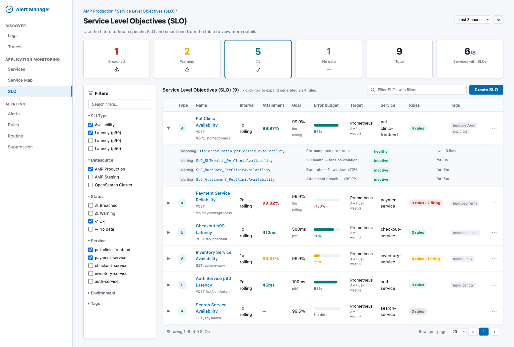
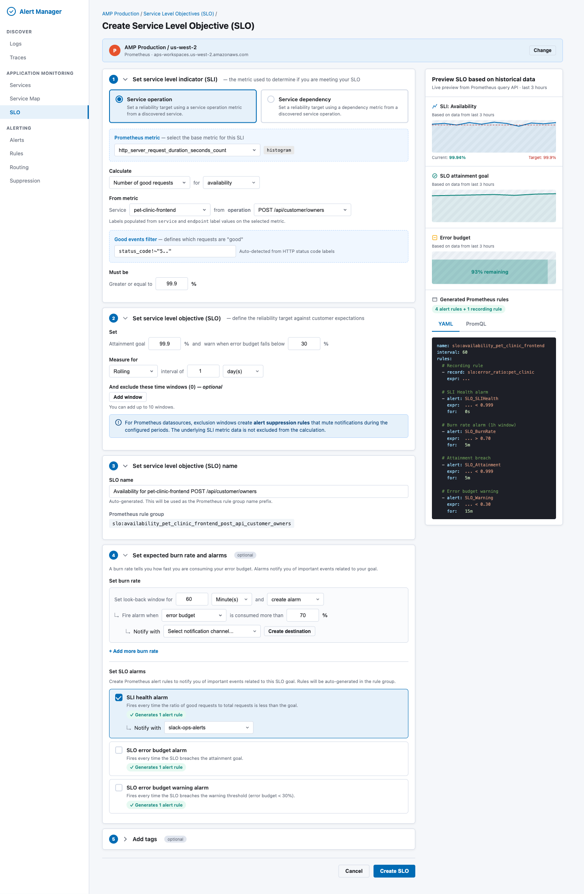
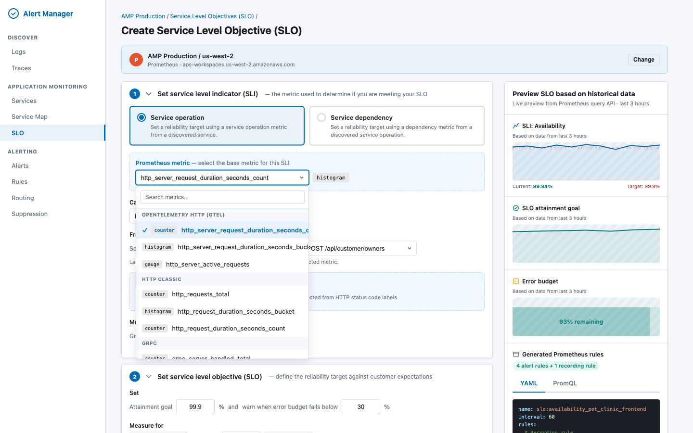
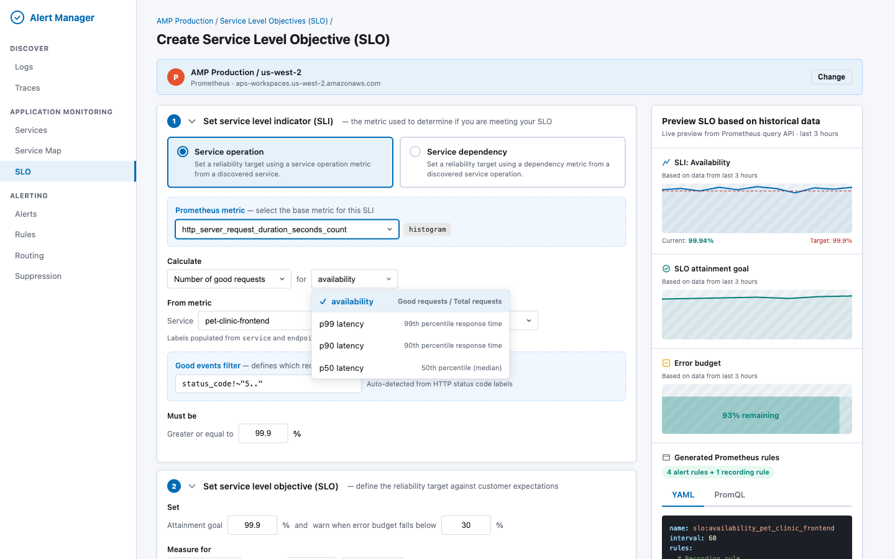
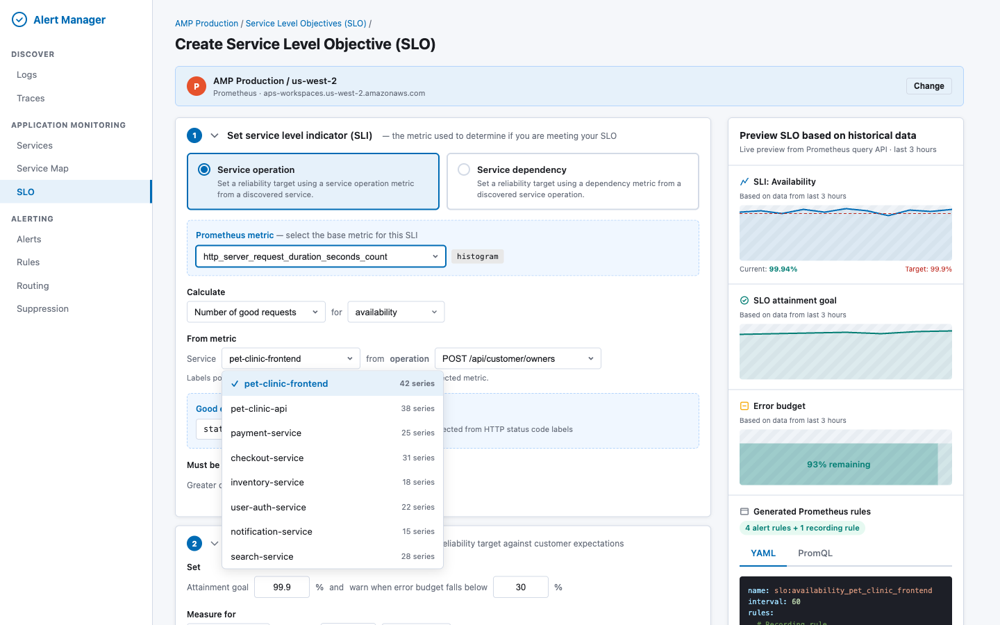
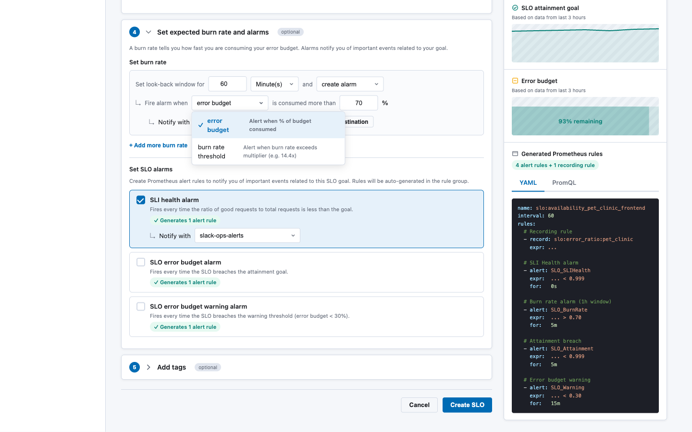
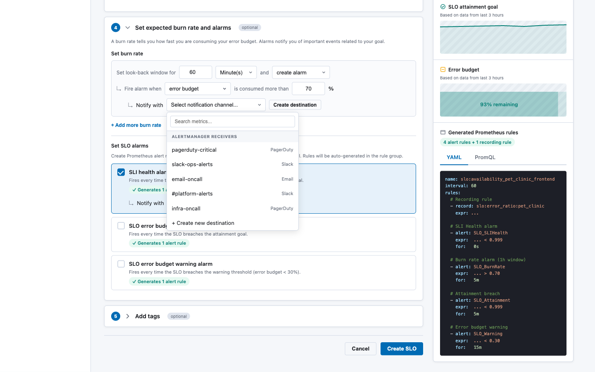

# RFC: Service Level Objectives (SLO/SLI) for Prometheus

**Status:** Draft
**Date:** 2026-03-16
**Authors:** Alert Manager Team
**Stakeholders:** Observability Platform, OpenSearch Plugin Team

---

## 1. Summary

This RFC proposes adding Service Level Objective (SLO) and Service Level Indicator (SLI) support to the Alert Manager plugin, backed by Prometheus metrics. Users will be able to define SLOs through a guided wizard UI hosted on **OpenSearch Dashboards**. The system will automatically generate and deploy the required Prometheus recording rules and alerting rules via the **OpenSearch SQL Direct Query APIs** — the existing infrastructure that proxies Prometheus operations (queries, ruler, alertmanager) through the OpenSearch plugin layer.

Prometheus has no native SLO primitive. A single SLO defined through this UI will decompose into **1 recording rule + 2–5 alerting rules** grouped in a single `PromRuleGroup`. The system manages the full lifecycle: create, read, update, delete.

---

## 2. Motivation

**Problem:** Teams using Prometheus for observability lack a structured way to define and track SLOs. Manually writing burn-rate alerting rules is error-prone, requires deep PromQL knowledge, and provides no unified view of SLO health across services.

**Opportunity:** The Alert Manager plugin already has:
- A multi-backend architecture (`MultiBackendAlertService`) that fetches rules from Prometheus datasources
- Unified types (`UnifiedRule`, `UnifiedAlert`) that abstract backend differences
- Full Prometheus API access via OpenSearch SQL's Direct Query resource layer (ruler, alertmanager, label/metadata APIs)

Adding an SLO layer on top creates a high-value experience with relatively low incremental effort.

**User stories:**
1. As a service owner, I want to define an availability SLO (e.g. "99.9% of requests succeed") and have the system generate all the necessary Prometheus alert rules.
2. As an on-call engineer, I want to see which SLOs are breached, how much error budget remains, and which services are at risk.
3. As a platform engineer, I want to configure multi-window burn-rate alerts following the Google SRE book pattern without writing PromQL by hand.

---

## 3. Architecture Overview

```
┌──────────────────────────────────────────────────────────────────┐
│  OpenSearch Dashboards                                            │
│  ┌────────────────┐  ┌────────────────┐  ┌────────────────────┐  │
│  │ SLO Listing    │  │ Create SLO     │  │ SLO Detail         │  │
│  │ (slo_listing)  │  │ (slo_wizard)   │  │ (slo_detail)       │  │
│  └───────┬────────┘  └───────┬────────┘  └───────┬────────────┘  │
│          │                   │                    │               │
│  ┌───────┴───────────────────┴────────────────────┴────────────┐  │
│  │  SLO Service (core/slo_service.ts)                          │  │
│  │  ┌──────────────┐  ┌──────────────┐  ┌───────────────────┐  │  │
│  │  │ SLO CRUD     │  │ PromQL Gen   │  │ Status Compute    │  │  │
│  │  │ (saved objs) │  │ (slo→rules)  │  │ (live attainment) │  │  │
│  │  └──────┬───────┘  └──────┬───────┘  └───────┬───────────┘  │  │
│  └─────────┼─────────────────┼──────────────────┼──────────────┘  │
└────────────┼─────────────────┼──────────────────┼────────────────┘
             │                 │                  │
    ┌────────┴─────────────────┴──────────────────┴──────────┐
    │  OpenSearch SQL Direct Query APIs                       │
    │  (/_plugins/_directquery/...)                           │
    │                                                         │
    │  Resources layer:                                       │
    │  ├─ GET  _resources/{ds}/api/v1/rules         ← read   │
    │  ├─ POST _resources/{ds}/api/v1/rules/{ns}    ← write  │
    │  ├─ DELETE _resources/{ds}/api/v1/rules/{ns}/{group}    │
    │  │                                                      │
    │  ├─ GET  _resources/{ds}/api/v1/labels        ← meta   │
    │  ├─ GET  _resources/{ds}/api/v1/metadata                │
    │  │                                                      │
    │  ├─ GET  _resources/{ds}/alertmanager/api/v2/silences   │
    │  ├─ POST _resources/{ds}/alertmanager/api/v2/silences   │
    │  ├─ GET  _resources/{ds}/alertmanager/api/v2/receivers  │
    │  │                                                      │
    │  Query layer:                                           │
    │  ├─ POST _directquery/_query/{ds}  (PromQL execution)   │
    │  └──────────────────────────────────────────────────────│
    └────────────────────┬────────────────────────────────────┘
                         │ HTTP (SigV4 / BasicAuth)
                  ┌──────┴──────┐
                  │  Prometheus  │
                  │  (AMP/Cortex │
                  │   /Mimir)    │
                  └─────────────┘
```

All Prometheus communication flows through the OpenSearch SQL plugin's Direct Query layer. The Alert Manager plugin **never calls Prometheus directly** — it uses:

| Operation | OpenSearch SQL API |
|---|---|
| Execute PromQL (instant/range) | `POST /_plugins/_directquery/_query/{datasource}` |
| Read alerting rules | `GET /_plugins/_directquery/_resources/{ds}/api/v1/rules` |
| Create/update rule group | `POST /_plugins/_directquery/_resources/{ds}/api/v1/rules/{namespace}` |
| Delete rule group | `DELETE /_plugins/_directquery/_resources/{ds}/api/v1/rules/{namespace}/{groupName}` |
| Get label names/values | `GET /_plugins/_directquery/_resources/{ds}/api/v1/labels` |
| Get metric metadata | `GET /_plugins/_directquery/_resources/{ds}/api/v1/metadata` |
| Get series | `GET /_plugins/_directquery/_resources/{ds}/api/v1/series` |
| List alertmanager receivers | `GET /_plugins/_directquery/_resources/{ds}/alertmanager/api/v2/receivers` |
| Manage silences | `GET/POST/DELETE /_plugins/_directquery/_resources/{ds}/alertmanager/api/v2/silences` |

---

## 4. Data Model

### 4.1 SLO Definition

The SLO definition is the source of truth from which all Prometheus rules are generated. It is persisted as an **OpenSearch Dashboards Saved Object** (type: `slo-definition`), keeping the experience self-contained within Dashboards with no additional OpenSearch index required.

```typescript
// core/slo_types.ts

export type SliType = 'availability' | 'latency_p99' | 'latency_p90' | 'latency_p50';
export type SliCalcMethod = 'good_requests' | 'good_periods';
export type SloWindowType = 'rolling' | 'calendar';
export type SloStatus = 'breached' | 'warning' | 'ok' | 'no_data';

export interface SliDefinition {
  /** The SLI type (availability or latency quantile) */
  type: SliType;
  /** Calculation method */
  calcMethod: SliCalcMethod;
  /** Base Prometheus metric name (e.g. "http_server_request_duration_seconds_count") */
  metric: string;
  /** Good events label filter (e.g. 'status_code!~"5.."') for availability SLIs */
  goodEventsFilter?: string;
  /** Latency threshold in seconds for latency SLIs (e.g. 0.5 for 500ms) */
  latencyThreshold?: number;
  /** Service label matcher */
  service: { labelName: string; labelValue: string };
  /** Operation label matcher */
  operation: { labelName: string; labelValue: string };
  /** Optional dependency label matcher */
  dependency?: { labelName: string; labelValue: string };
  /** Period length for "good_periods" method (e.g. "1m") */
  periodLength?: string;
}

export interface BurnRateConfig {
  /** Lookback window (e.g. "1h", "6h") */
  window: string;
  /** Fire mode */
  mode: 'error_budget' | 'burn_rate_threshold';
  /** Threshold value — budget % consumed (0-1) or burn rate multiplier */
  threshold: number;
  /** Whether to create an alarm for this burn rate */
  createAlarm: boolean;
  /** Notification channel for this burn rate alarm */
  notificationChannel?: string;
}

export interface SloAlarmConfig {
  /** SLI health alarm — fires on every bad evaluation */
  sliHealth: { enabled: boolean; notificationChannel?: string };
  /** Attainment breach — fires when SLO target is not met over the full window */
  attainmentBreach: { enabled: boolean; notificationChannel?: string };
  /** Error budget warning — fires when remaining budget drops below threshold */
  budgetWarning: { enabled: boolean; notificationChannel?: string };
}

export interface ExclusionWindow {
  name: string;
  /** CRON expression for recurring windows, or ISO datetime for one-time */
  schedule: string;
  /** Duration of the exclusion (e.g. "1h", "2h") */
  duration: string;
  reason?: string;
}

export interface SloDefinition {
  id: string;
  /** Prometheus datasource ID (from OpenSearch SQL datasource registry) */
  datasourceId: string;
  /** Human-readable name */
  name: string;
  /** SLI configuration */
  sli: SliDefinition;
  /** Target attainment (e.g. 0.999 for 99.9%) */
  target: number;
  /** Error budget warning threshold (e.g. 0.30 for "warn when budget < 30%") */
  budgetWarningThreshold: number;
  /** Measurement window */
  window: {
    type: SloWindowType;
    duration: string; // e.g. "1d", "7d", "30d"
  };
  /** Burn rate configurations (multiple windows supported) */
  burnRates: BurnRateConfig[];
  /** SLO alarm toggles */
  alarms: SloAlarmConfig;
  /** Exclusion windows (mapped to alertmanager silences) */
  exclusionWindows: ExclusionWindow[];
  /** User-defined tags (added to all generated rule labels) */
  tags: Record<string, string>;
  /** Generated Prometheus rule group name */
  ruleGroupName: string;
  /** Ruler namespace where rules are deployed */
  rulerNamespace: string;
  /** Metadata */
  createdAt: string;
  createdBy: string;
  updatedAt: string;
}
```

### 4.2 Computed SLO Status (read-time)

```typescript
export interface SloLiveStatus {
  sloId: string;
  /** Current SLI value (e.g. 0.9997 for 99.97% availability, or 412ms for latency) */
  currentValue: number;
  /** Current attainment over the window */
  attainment: number;
  /** Error budget remaining (0-1, can go negative) */
  errorBudgetRemaining: number;
  /** Computed status */
  status: SloStatus;
  /** Number of generated rules */
  ruleCount: number;
  /** Number of currently firing rules */
  firingCount: number;
  /** Timestamp of computation */
  computedAt: string;
}
```

### 4.3 Storage — OpenSearch Dashboards Saved Objects

SLO definitions are stored as **OpenSearch Dashboards Saved Objects** with type `slo-definition`. This approach:

- Requires **no additional OpenSearch index** — saved objects live in the existing `.kibana` index managed by Dashboards
- Supports import/export via Dashboards' built-in Saved Objects management UI
- Inherits Dashboards' tenancy and workspace isolation model
- Allows SLO definitions to be backed up and restored alongside other Dashboards content (visualizations, dashboards, etc.)

The saved object `attributes` field stores the full `SloDefinition` payload. Prometheus rule labels contain `slo_id` as a back-reference to the saved object ID.

**Saved object registration:**

```typescript
// server/saved_objects/slo_definition.ts

export const sloDefinitionType: SavedObjectsType = {
  name: 'slo-definition',
  hidden: false,
  namespaceType: 'single',  // workspace-scoped
  mappings: {
    properties: {
      name: { type: 'text' },
      datasourceId: { type: 'keyword' },
      sli: { type: 'object', enabled: false },
      target: { type: 'float' },
      budgetWarningThreshold: { type: 'float' },
      window: { type: 'object', enabled: false },
      burnRates: { type: 'object', enabled: false },
      alarms: { type: 'object', enabled: false },
      exclusionWindows: { type: 'object', enabled: false },
      tags: { type: 'object', enabled: false },
      ruleGroupName: { type: 'keyword' },
      rulerNamespace: { type: 'keyword' },
      createdAt: { type: 'date' },
      createdBy: { type: 'keyword' },
      updatedAt: { type: 'date' },
    },
  },
};
```

**CRUD operations** use the standard Dashboards Saved Objects client:

```typescript
// Create
const slo = await savedObjectsClient.create('slo-definition', attributes, { id: generatedId });

// List with search
const results = await savedObjectsClient.find({
  type: 'slo-definition',
  search: 'pet-clinic',
  searchFields: ['name'],
  filter: 'slo-definition.attributes.datasourceId: ds-1',
  perPage: 20,
  page: 1,
});

// Get
const slo = await savedObjectsClient.get('slo-definition', sloId);

// Update
await savedObjectsClient.update('slo-definition', sloId, updatedAttributes);

// Delete
await savedObjectsClient.delete('slo-definition', sloId);
```

---

## 5. PromQL Generation

### 5.1 Generator Module

The `SloPromqlGenerator` is a pure, stateless module that converts an `SloDefinition` into a `PromRuleGroup` (recording + alerting rules in YAML format). This module has zero I/O — it takes a definition and returns a string.

```typescript
// core/slo_promql_generator.ts

export interface GeneratedRuleGroup {
  /** YAML string ready to POST to the ruler API */
  yaml: string;
  /** Parsed structure for display in the UI */
  rules: Array<{
    type: 'recording' | 'alerting';
    name: string;
    expr: string;
    for?: string;
    labels: Record<string, string>;
    annotations?: Record<string, string>;
  }>;
}

export function generateSloRuleGroup(slo: SloDefinition): GeneratedRuleGroup;
```

### 5.2 Generation Patterns

#### Availability SLI (request-based)

**Recording rule** — pre-compute the error ratio for efficiency:

```yaml
- record: slo:error_ratio:<sanitized_name>
  expr: |
    1 - (
      sum(rate(<metric>{<service_label>="<service>", <op_label>="<operation>", <good_filter>}[5m]))
      / sum(rate(<metric>{<service_label>="<service>", <op_label>="<operation>"}[5m]))
    )
  labels:
    slo_id: "<id>"
    slo_name: "<name>"
```

**SLI Health alert** — fires on every bad evaluation:

```yaml
- alert: SLO_SLIHealth_<sanitized_name>
  expr: |
    (
      sum(rate(<metric>{<service_label>="<service>", <op_label>="<operation>", <good_filter>}[5m]))
      / sum(rate(<metric>{<service_label>="<service>", <op_label>="<operation>"}[5m]))
    ) < <target>
  for: 0s
  labels:
    severity: warning
    slo_id: "<id>"
    alarm_type: sli_health
```

**Burn rate alert** (error budget mode):

```yaml
- alert: SLO_BurnRate_<sanitized_name>
  expr: |
    (
      1 - (
        sum(rate(<metric>{...good}[<window>]))
        / sum(rate(<metric>{...total}[<window>]))
      )
    ) / <error_budget> > <threshold>
  for: 5m
  labels:
    severity: critical
    slo_id: "<id>"
    alarm_type: burn_rate
```

Where `<error_budget> = 1 - <target>` (e.g. `1 - 0.999 = 0.001`).

**Burn rate alert** (burn rate threshold mode):

Same expression structure, but `<threshold>` is the raw multiplier (e.g. `14.4`) instead of a percentage.

**Attainment breach alert**:

```yaml
- alert: SLO_Attainment_<sanitized_name>
  expr: |
    (
      sum(rate(<metric>{...good}[<slo_window>]))
      / sum(rate(<metric>{...total}[<slo_window>]))
    ) < <target>
  for: 5m
  labels:
    severity: critical
    slo_id: "<id>"
    alarm_type: attainment
```

**Error budget warning alert**:

```yaml
- alert: SLO_Warning_<sanitized_name>
  expr: |
    1 - (
      (1 - (sum(rate(<metric>{...good}[<slo_window>])) / sum(rate(<metric>{...total}[<slo_window>]))))
      / <error_budget>
    ) < <budget_warning_threshold>
  for: 15m
  labels:
    severity: warning
    slo_id: "<id>"
    alarm_type: error_budget_warning
```

#### Latency SLI

For latency SLIs, the recording rule uses `histogram_quantile`:

```yaml
- record: slo:latency_p99:<sanitized_name>
  expr: |
    histogram_quantile(0.99,
      sum(rate(<metric_bucket>{<service_label>="<service>", <op_label>="<operation>"}[5m])) by (le)
    )
  labels:
    slo_id: "<id>"
```

Alert fires when latency **exceeds** the threshold:

```yaml
- alert: SLO_SLIHealth_<sanitized_name>
  expr: |
    histogram_quantile(0.99, sum(rate(...[5m])) by (le)) > <latency_threshold>
  for: 0s
```

#### Period-based SLIs

Period-based SLIs require an additional boolean recording rule:

```yaml
# Was this period "good"?
- record: slo:good_period:<sanitized_name>
  expr: |
    (sum(rate(<good>[<period>])) / sum(rate(<total>[<period>]))) >= <target>

# Attainment over window
- alert: SLO_Attainment_<sanitized_name>
  expr: |
    avg_over_time(slo:good_period:<sanitized_name>[<slo_window>]) < <target>
  for: 5m
```

### 5.3 All Generated Rules Summary

| SLO Config | Generated Rule | Type | Condition |
|---|---|---|---|
| Always | `slo:error_ratio:<name>` | recording | Pre-computed error ratio |
| SLI Health enabled | `SLO_SLIHealth_<name>` | alerting | SLI < target (fires immediately) |
| Each burn rate row | `SLO_BurnRate_<name>_<window>` | alerting | Budget consumed > threshold |
| Attainment enabled | `SLO_Attainment_<name>` | alerting | Attainment < target over window |
| Budget warning enabled | `SLO_Warning_<name>` | alerting | Budget remaining < warning threshold |

Typical SLO generates **1 recording + 3-4 alerting = 4-5 rules total**.

---

## 6. SLO Service

### 6.1 Lifecycle Operations

```typescript
// core/slo_service.ts

export class SloService {
  constructor(
    private readonly savedObjectsClient: SavedObjectsClientContract,
    private readonly directQueryApi: DirectQueryApi,
    private readonly logger: Logger
  ) {}

  /** Create SLO: store saved object + deploy rules + create silences */
  async create(input: Omit<SloDefinition, 'id' | 'createdAt' | 'updatedAt'>): Promise<SloDefinition>;

  /** List all SLOs from saved objects */
  async list(filters?: SloListFilters): Promise<PaginatedResponse<SloDefinition>>;

  /** Get a single SLO definition */
  async get(sloId: string): Promise<SloDefinition | null>;

  /** Update SLO: regenerate rules atomically, update silences */
  async update(sloId: string, input: Partial<SloDefinition>): Promise<SloDefinition>;

  /** Delete SLO: remove rules + silences + saved object */
  async delete(sloId: string): Promise<boolean>;

  /** Compute live status by executing PromQL queries */
  async getStatus(sloId: string): Promise<SloLiveStatus>;

  /** Batch status for listing page */
  async getStatuses(sloIds: string[]): Promise<SloLiveStatus[]>;
}
```

### 6.2 Create Flow

```
User submits SLO form
       │
       ▼
┌─────────────────────────────┐
│ 1. Validate SloDefinition   │
│    (slo_validators.ts)      │
└──────────┬──────────────────┘
           │
           ▼
┌─────────────────────────────┐
│ 2. Generate PromRuleGroup   │
│    (slo_promql_generator)   │
│    → YAML string            │
└──────────┬──────────────────┘
           │
           ▼
┌─────────────────────────────────────────────────┐
│ 3. Deploy rules via OpenSearch SQL Ruler API     │
│                                                  │
│    POST /_plugins/_directquery/_resources/{ds}/   │
│         api/v1/rules/{namespace}                 │
│    Body: <generated YAML>                        │
└──────────┬──────────────────────────────────────┘
           │
           ▼
┌─────────────────────────────────────────────────┐
│ 4. Create silences for exclusion windows         │
│    (if any configured)                           │
│                                                  │
│    POST /_plugins/_directquery/_resources/{ds}/   │
│         alertmanager/api/v2/silences             │
└──────────┬──────────────────────────────────────┘
           │
           ▼
┌──────────────────────────────────┐
│ 5. Store SloDefinition as        │
│    Dashboards Saved Object       │
│    (type: slo-definition)        │
└──────────┬───────────────────────┘
           │
           ▼
       Return SLO
```

### 6.3 Status Computation

Live SLO status is computed on-read by executing PromQL queries through the Direct Query API:

```typescript
async getStatus(sloId: string): Promise<SloLiveStatus> {
  const slo = await this.get(sloId);

  // Execute the SLI query for current value
  const sliResult = await this.directQueryApi.query({
    datasource: slo.datasourceId,
    query: buildSliQuery(slo),      // PromQL for current SLI ratio
    language: 'PROMQL',
    options: { queryType: 'instant' }
  });

  // Execute the attainment query over the full window
  const attainmentResult = await this.directQueryApi.query({
    datasource: slo.datasourceId,
    query: buildAttainmentQuery(slo), // PromQL for window attainment
    language: 'PROMQL',
    options: { queryType: 'instant' }
  });

  // Read rule states from the ruler
  const rules = await this.directQueryApi.getResources({
    datasource: slo.datasourceId,
    resourceType: 'rules',
    params: { 'rule_name[]': `SLO_.*_${slo.ruleGroupName}` }
  });

  return computeStatus(slo, sliResult, attainmentResult, rules);
}
```

---

## 7. API Surface

All SLO endpoints are served by the Alert Manager plugin's server-side route handlers within OpenSearch Dashboards.

| Method | Path | Description |
|---|---|---|
| `POST` | `/api/slos` | Create a new SLO |
| `GET` | `/api/slos` | List SLOs (paginated, filterable) |
| `GET` | `/api/slos/:id` | Get SLO definition + live status |
| `PUT` | `/api/slos/:id` | Update SLO (regenerates all rules atomically) |
| `DELETE` | `/api/slos/:id` | Delete SLO + all generated rules + silences |
| `GET` | `/api/slos/:id/status` | Live status only (lightweight) |
| `GET` | `/api/slos/statuses` | Batch status for listing page |
| `POST` | `/api/slos/:id/preview` | Preview generated rules without deploying |
| `GET` | `/api/slos/metrics` | Metric discovery: list available metrics from a datasource |
| `GET` | `/api/slos/labels` | Label value discovery for a given metric |

### 7.1 Query Parameters for Listing

```
GET /api/slos?datasourceId=ds-1&status=breached,warning&service=pet-clinic&sliType=availability&page=1&pageSize=20&sort=attainment:asc
```

---

## 8. UI Design

The UI is hosted on OpenSearch Dashboards and follows an accordion-based wizard pattern. Interactive HTML mockups are available at `docs/mockups/slo-create-prometheus.html` and `docs/mockups/slo-listing-prometheus.html`.

### 8.1 SLO Listing Page

The listing page provides an at-a-glance view of all SLOs with live status, error budget progress bars, and expandable rows showing the generated Prometheus rules for each SLO.



Key elements:
- **Status cards** — Breached, Warning, Ok, No data, Total, Services with SLOs (computed from batch `getStatuses()`)
- **Filter sidebar** — SLI Type (Availability/Latency), Datasource, Status, Service, Environment, Tags
- **Table columns** — Type (A/L icon), Name, Interval, Attainment, Goal, Error budget (progress bar), Target, Service, Rules count, Tags
- **Expandable rows** — Clicking a row reveals all generated Prometheus rules (recording + alerting) with their health status and evaluation time
- **Actions** — "Create SLO" button, per-row menu (edit, delete, view rules, silence)

### 8.2 Create SLO Wizard

The Create SLO form is a five-section accordion with a live preview panel on the right.



---

**Section 1: Set Service Level Indicator (SLI)**

| Field | Behavior |
|---|---|
| Source type (radio) | "Service operation" or "Service dependency" |
| Prometheus metric picker | Grouped by convention: OTEL HTTP, HTTP Classic, gRPC, Custom. Shows metric type badge. |
| Calculate method | "Number of good requests" or "Number of good periods" |
| SLI type | Availability, p99 latency, p90 latency, p50 latency |
| Service picker | Populated from Prometheus label values |
| Operation picker | Populated from `endpoint` / `http_route` label values, filtered by selected service |
| Good events filter | Pre-populated `status_code!~"5.."` for HTTP metrics; editable |
| Threshold ("Must be") | `>= X%` for availability, `<= X ms` for latency |

**Metric picker dropdown** — metrics are fetched via `GET _resources/{ds}/api/v1/metadata` and grouped by naming convention. Each metric shows a type badge (counter/histogram/gauge):



**SLI type dropdown** — determines the PromQL pattern and threshold direction:



**Service picker** — populated from Prometheus label values via `GET _resources/{ds}/api/v1/label/service/values?match[]={metric}`, with series count for each service:



**Metric auto-detection logic:** When the user selects a metric, the UI fetches its labels via `GET _resources/{ds}/api/v1/labels?match[]={metric}`. If labels include `status_code` or `status`, the good events filter is pre-populated. If the metric name ends in `_bucket`, the SLI type defaults to latency.

---

**Section 2: Set Service Level Objective (SLO)**

| Field | Behavior |
|---|---|
| Attainment goal | Numeric input (e.g. "99.9") in % |
| Budget warning threshold | "Warn when error budget falls below X%" |
| Window type | Rolling (fully supported) or Calendar (approximated as rolling, with info callout) |
| Window duration | Number + unit (days/months) |
| Exclusion windows | Up to 10 windows with CRON or datetime schedule. Info callout: "Exclusion windows create alert suppression rules that mute notifications during the configured periods. The underlying SLI metric data is not excluded from the calculation." |

---

**Section 3: Set SLO Name**

| Field | Behavior |
|---|---|
| SLO name | Auto-generated from service + operation + SLI type. Editable. |
| Rule group name | Displayed read-only: `slo:<sanitized_name>` |

---

**Section 4: Set Expected Burn Rate and Alarms** *(optional)*

| Field | Behavior |
|---|---|
| Burn rate rows | Configurable lookback window, mode, threshold, notification channel. "Add more burn rate" for multi-window strategy. |
| SLI health alarm | Checkbox — generates 1 alerting rule |
| Attainment breach alarm | Checkbox — generates 1 alerting rule |
| Error budget warning alarm | Checkbox — generates 1 alerting rule |

**Burn rate mode dropdown** — choose between error budget percentage or burn rate multiplier:



**Notification channel dropdown** — populated from Alertmanager receivers via `GET _resources/{ds}/alertmanager/api/v2/receivers`:



---

**Section 5: Add Tags** *(optional)*

Key-value pairs added to all generated rule labels with `tag_` prefix.

---

**Preview Panel** (right sidebar, sticky):

| Section | Source |
|---|---|
| SLI chart (last 3h) | `POST _directquery/_query/{ds}` with range query |
| SLO attainment goal chart | Range query over the configured window |
| Error budget chart | Computed from attainment query |
| Generated Prometheus rules | Output of `SloPromqlGenerator` — tabbed YAML / PromQL view |

### 8.3 New Components

| Component | File | Purpose |
|---|---|---|
| `CreateSloWizard` | `standalone/components/create_slo_wizard.tsx` | 5-section accordion form |
| `SloListing` | `standalone/components/slo_listing.tsx` | Listing table with filters and status cards |
| `SloPreviewPanel` | `standalone/components/slo_preview_panel.tsx` | Right-side preview (charts + generated rules) |
| `MetricLabelPicker` | `standalone/components/metric_label_picker.tsx` | Cascading metric → label value selector |
| `BurnRateConfigurator` | `standalone/components/burn_rate_configurator.tsx` | Multi-row burn rate editor |
| `PromQLPreview` | `standalone/components/promql_preview.tsx` | Syntax-highlighted PromQL/YAML display |
| `SloDetailPanel` | `standalone/components/slo_detail_panel.tsx` | Full SLO detail with history |

### 8.4 Modified Components

| Component | Change |
|---|---|
| `alarms_page.tsx` | Add "SLO" tab linking to `SloListing` and `CreateSloWizard` |
| `core/types.ts` | Add SLO types; extend `UnifiedRule` with optional `sloMetadata` field |
| `core/alert_service.ts` | Add SLO-aware rule grouping in `fetchRulesRaw()` to collapse SLO rules into a single entry |

---

## 9. Exclusion Windows → Alertmanager Silences

Prometheus cannot retroactively exclude time-window data from `rate()` computations. Instead, exclusion windows are implemented as **Alertmanager silences** that suppress notifications during configured periods.

**Create flow:**

```
For each ExclusionWindow in slo.exclusionWindows:
  1. Convert CRON schedule to next N occurrences (startsAt/endsAt pairs)
  2. For each occurrence:
     POST /_plugins/_directquery/_resources/{ds}/alertmanager/api/v2/silences
     {
       "matchers": [
         { "name": "slo_id", "value": "<slo_id>", "isRegex": false, "isEqual": true }
       ],
       "startsAt": "<ISO8601>",
       "endsAt": "<ISO8601>",
       "createdBy": "slo-manager",
       "comment": "SLO exclusion window: <window_name> — <reason>"
     }
  3. Store silence IDs in SLO saved object for lifecycle management
```

**Limitation documented in UI:** "For Prometheus datasources, exclusion windows create alert suppression rules that mute notifications during the configured periods. The underlying SLI metric data is not excluded from the calculation."

For recurring CRON-based windows, a background job (or on-demand at SLO read time) creates upcoming silences for the next 7 days and garbage-collects expired ones.

---

## 10. Metric Discovery

The Create SLO wizard needs to populate metric and label dropdowns dynamically. All discovery goes through the OpenSearch SQL Direct Query resources API.

### 10.1 Available Metrics

```
GET /_plugins/_directquery/_resources/{ds}/api/v1/metadata
```

Returns metric names grouped by type (counter, histogram, gauge, summary). The UI groups these by naming convention:

| Group | Pattern | Examples |
|---|---|---|
| OpenTelemetry HTTP | `http_server_*` | `http_server_request_duration_seconds_count`, `_bucket` |
| HTTP Classic | `http_request*` | `http_requests_total`, `http_request_duration_seconds_bucket` |
| gRPC | `grpc_server_*` | `grpc_server_handled_total`, `grpc_server_handling_seconds_bucket` |
| Custom | Everything else | User-defined metrics |

### 10.2 Label Values (cascading)

```
# Step 1: Get labels for the selected metric
GET /_plugins/_directquery/_resources/{ds}/api/v1/labels?match[]=http_requests_total

# Step 2: Get service values
GET /_plugins/_directquery/_resources/{ds}/api/v1/label/service/values?match[]=http_requests_total

# Step 3: Get operation values filtered by service
GET /_plugins/_directquery/_resources/{ds}/api/v1/label/endpoint/values?match[]=http_requests_total{service="pet-clinic"}
```

### 10.3 Good Events Filter Auto-detection

When a metric is selected, the UI checks its labels. If any of these labels exist, the good events filter is pre-populated:

| Label | Auto-filter |
|---|---|
| `status_code` | `status_code!~"5.."` |
| `status` | `status!~"5.."` |
| `grpc_code` | `grpc_code!="Internal"` |
| `error` | `error=""` |

The user can always override the auto-detected filter.

---

## 11. Gaps and Limitations

| Capability | Gap | Mitigation |
|---|---|---|
| Calendar-month windows | PromQL only supports fixed-duration ranges | Approximate as rolling; document in UI callout |
| Exclusion windows exclude data | PromQL cannot retroactively filter by time | Suppress alerts via silences; document difference |
| Auto-discovered services | No built-in service discovery | Query label values dynamically; leverage OTEL conventions |
| Native SLO object | No SLO primitive in Prometheus | Store as Dashboards Saved Object |
| Error budget visualization | Must be computed on read | Execute PromQL at query time; cache briefly |
| Standalone Prometheus ruler | Requires filesystem write access | MVP targets AMP/Cortex/Mimir ruler APIs only; standalone Prometheus not supported in v1 |
| Recording rule for period SLIs | Adds dependency on rule evaluation delay | Document that period-based SLIs have a 1-evaluation-cycle lag |

---

## 12. Security Considerations

- **Datasource auth:** All Prometheus calls are proxied through OpenSearch SQL, which handles authentication (SigV4 for AMP, BasicAuth for self-managed). The SLO service does not manage credentials directly.
- **Rule deployment permissions:** Writing rules via the ruler API requires appropriate IAM permissions for AMP or admin access for Cortex/Mimir. The Direct Query layer enforces these.
- **Saved object access:** SLO definitions stored as Dashboards Saved Objects inherit the Dashboards security model, including workspace isolation and tenant-scoped access controls.
- **Silence creation:** Creating Alertmanager silences requires appropriate permissions, enforced at the Alertmanager level.
- **PromQL injection:** The `SloPromqlGenerator` constructs PromQL from validated, structured inputs (not raw user strings). Label values are escaped. The good events filter is the only free-text PromQL input and must be validated for syntactic correctness before deployment.

---

## 13. Testing Strategy

| Layer | Approach |
|---|---|
| `SloPromqlGenerator` | Unit tests with snapshot assertions. Given an `SloDefinition`, assert exact YAML output. Cover: availability, latency (p99/p90/p50), period-based, multiple burn rates, all alarm types. |
| `SloService` | Integration tests with mocked Direct Query API. Verify create deploys rules, update replaces atomically, delete removes all artifacts. |
| Saved Objects | Integration tests verifying CRUD through the saved objects client, including search/filter behavior. |
| Status computation | Unit tests with canned PromQL results. Verify attainment, budget, and status derivation. |
| UI components | React Testing Library for form validation, field interdependencies (e.g. switching SLI type changes available fields), and preview panel rendering. |
| End-to-end | Playwright tests against the full stack: create SLO → verify rules appear in Prometheus → trigger alert → verify listing shows breached status. |

---

## 14. Open Questions

1. **Multi-cluster SLOs:** Should a single SLO be able to span multiple Prometheus datasources (e.g. aggregate availability across regions)? This RFC scopes to single-datasource SLOs. Multi-cluster can be added later by introducing a "federated SLO" type.

2. **Recording rule namespace:** Should all SLO recording rules be deployed to a dedicated ruler namespace (e.g. `slo-generated`) or per-service namespaces? A dedicated namespace simplifies listing and cleanup.

3. **Rate limiting:** Creating an SLO triggers multiple API calls (metadata lookup, rule deployment, silence creation, saved object write). Should we add rate limiting to prevent abuse?

4. **Migration from manual rules:** If a team already has hand-written burn-rate rules, should the SLO system detect and offer to "adopt" them? This is a v2 concern.

5. **Saved object export/import:** When SLO definitions are exported via Dashboards' Saved Objects management, the corresponding Prometheus rules are not included. Should the import flow automatically re-deploy rules, or require a manual "sync" step?

---

## 15. References

- [Google SRE Book — Chapter 5: Alerting on SLOs](https://sre.google/workbook/alerting-on-slos/)
- [Prometheus Recording Rules](https://prometheus.io/docs/prometheus/latest/configuration/recording_rules/)
- [OpenSearch SQL Direct Query API](https://opensearch.org/docs/latest/search-plugins/sql/direct-query/)
- [OpenSearch Dashboards Saved Objects](https://opensearch.org/docs/latest/dashboards/management/saved-objects/)
- UI Mockups: [`docs/mockups/slo-create-prometheus.html`](mockups/slo-create-prometheus.html), [`docs/mockups/slo-listing-prometheus.html`](mockups/slo-listing-prometheus.html)
- Mapping Report: [`docs/slo-prometheus-mapping-report.md`](slo-prometheus-mapping-report.md)
- Alert Manager types: `core/types.ts`
